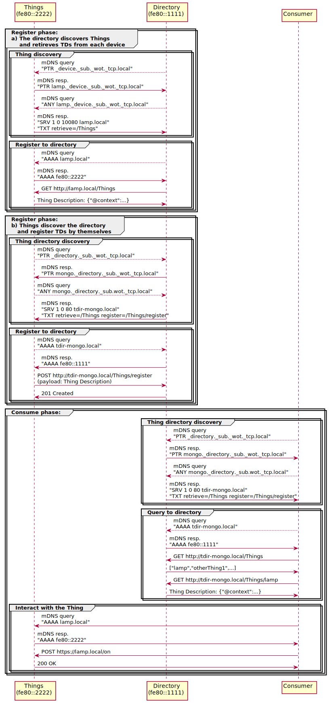

# Fujitsu's Thing Discovery implementation

- Author: Takahisa Suzuki (@tksuzuki0604) (original text: https://github.com/w3c/wot-discovery/issues/5 )
- Editor: Kunihiko Toumura (@k-toumura)

## Use-case

- Using appliances in smart home
- These appliances and a controller is located in the same network
  - The controller has a TD directory
  - All devices retrieve IP address from a DHCP server
    - Also the DHCP server is located in the network
- All TDs are registered to the directory
  - Implemented three ways to register TDs to the directory
    - a) The directory discovers Things and retrieves TDs from each device
    - b) Things discover the directory and register TDs by themselves
    - c) Human discover the directory and register TDs manually
- Users retrieve all TDs from the directory and select desired appliances in the local network

## Requirements
- Needs to set each device's URL(ip address or resolvable hostname) in its TD (hrefs or base)
  - Things set URLs by themselves (case 'a' and 'b')
  - Human set URLs to TDs manually (case 'c')
- Needs to search Things and the directory in the same network
- The directory needs to know how to retrieve TD from Things for the case 'a'
- Human and Things needs to know how to register TD to the directory for case 'b' and 'c'
- Users need to know how to retrieve TDs from the directory
- Needs a TD directory implementation

## Implementation
- Set unique hostnames to all devices (Things and the directory)
- Set `<hostname>.local` as a resolvable hostname in TDs for all cases
- Used mDNS and DNS-SD to discover things and directories
- Used DNS-SD to advertise the way to retrieve or register TDs
- Used mDNS to resolve hostname in TDs
- Used Mongo DB as a backend of directories
- Made a python script to cooperate mDNS+DNS-SD with MongoDB
  - The script also provides REST APIs to register and retrieve TDs from the directory

## Discovery Protocol Detail

### mDNS+DNS-SD settings
Followings are examples of mDNS+DNS-SD settings.
- Thing
```
Service type: _wot._tcp
Sub type: _device._sub._wot._tcp
Port: 10080
Text record: "retrieve=/Things"
```

- Directory
```
Service type: _wot._tcp
Sub type: _directory._sub._wot._tcp
Port: 80
Text record: “retrieve=/Things“ “register=/Things/register”
```

### Example Sequences


- [PlantUML source file for above diagram](tksuzuki-discovery.puml)