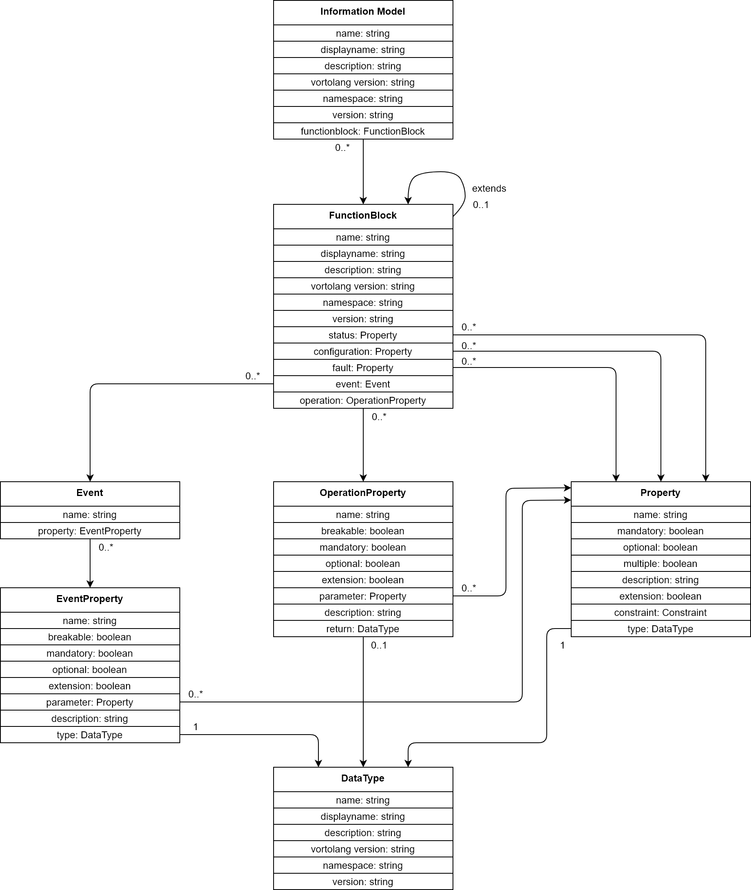

# Vorto and WoT
Eclipse Vorto is an OpenSource project for semantic IoT device modelling. It consists of 3 main components: 
1. [Vortolang](https://github.com/eclipse/vorto/blob/development/docs/vortolang-1.0.md) - a domain specific language (DSL) 
2. [Repository](https://vorto.eclipse.org/) - manage, edit and distribute Vorto models
3. [Plugins](https://vorto.eclipse.org/#/generators) - transform Vorto models (i.e. into code, request templates, other representations, ...)

The goal of this proposal is an alignment between the Vorto and WoT to create interoperability between both ecosystems. 
The first steps are to identify the similarities and differences in the concepts, create a mapping of 
the vocabularies to get a common understanding and compare examples of models in both representations 
as described in [this issue](https://github.com/w3c/wot-discovery/issues/7). 
It is also proposed that a Vorto example, for example using a Vorto vocabulary extension for search,
be added to the final document, however this would be informative only.

## Conceptual Comparison
Common approach:
* The modelling of device data is very similar. Attributes of devices are categorized. 
In Vorto the categories are: **status** (read-only properties), **configuration** (read-write properties), 
**events**, **operations** (functions that can be invoked on the device) and **faults**. In the Thing description 
the categories are: **properties**, **events** and **actions**.

Conceptual differences: 
* Vorto only contains abstract models of device types, not concrete instances of devices. 
It therefore doesn't handle things like specific endpoints, instance IDs, etc...


## Vocabulary Mapping
WoT Thing Description vocabulary: 


Vorto vocabulary:


## Example
To compare the two modelling approaches, here is an example of the model for a Lamp as Vorto Function
Block and the same model as WoT Thing Description Template. 

Lamp as Vorto Function Block: 
```java
vortolang 1.0
namespace com.kevin.official.test.w3c
version 1.0.0
displayname "LampFB"
description "Functionblock for LampFB"

functionblock LampFB {

    configuration {
        property as string
    }
    
    status {
        extension state as string "current status of the lamp (on|off)"
    }
    
    events {
         overheating {
            data as string "Lamp reaches a critical temperature (overheating)"
        } 
    }
    operations {
        toggle() "Turn the lamp on or off"
    }

}
```

Lamp as Thing Description Template: 
```json
{
    "@context": ["https://www.w3.org/2019/wot/td/v1"], 
    "@type" : "ThingTemplate",
    "title": "Lamp Thing Description Template",
    "description" : "Lamp Thing Description Template",
    "properties": {
        "status": {
            "description" : "current status of the lamp (on|off)",
            "type": "string",
            "readOnly": true
        }
    },
    "actions": {
        "toggle": {
            "description" : "Turn the lamp on or off"
        }
    },
    "events": {
        "overheating": {
            "description" : "Lamp reaches a critical temperature (overheating)",
            "data": {"type": "string"}
        }
    }
}
```
